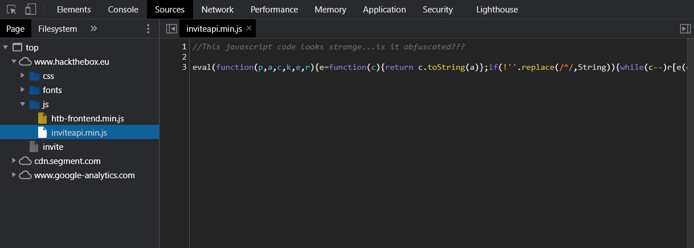

# HTB Invitation Write-Up

# Hack The Box

Il s'agît de mon Write Up pour l'obtention du code d'invitation de Hack The Box.

Je trouve que ce principe est vraiment bien, parce que, en le réussissant, on se sent "légitime" d'appartenir à cette communauté :)

**Ce document contient des spoilers pouvant vous gâcher l'aventure. Les codes finaux sont censurés.**

## Premier regard

La première fois que je suis arrivée sur la page d'accueil, j'ai été surprise par le fait qu'il faille "hacker" le site pour s'inscrire. J'ai donc commencé à enquêter, mais j'ai été vite refroidie en voyant la tête du code JavaScript. 

Quelques mois plus tard, j'ai décidé de reprendre le challenge. 

### Accueil

En essayant de se créer un compte, on tombe donc sur cette page :


Me trouvant sur une page web, je décide donc de commencer par inspecter la console JS de la page. Nous tombons alors sur cette image en ASCII art :


C'est donc le début de l'aventure.

Cependant, ne savant pas trop par quoi commencer, j'ai décidé de m'inscrire sur [academy.hackthebox.eu](http://academy.hackthebox.eu), ainsi j'ai fait le cours Crack into HTB, et j'avais tout ce dont j'avais besoin pour me lancer à fond dedans.

### Fichiers JS

En allant dans l'onglet "source" de l'inspecteur du navigateur, comme nous l'indique la ligne en bas de l'ASCII art, nous trouvons un fichier plutôt intéressant :



Le code de ce fichier est :

```jsx
//This javascript code looks strange...is it obfuscated???

eval(function(p,a,c,k,e,r){e=function(c){return c.toString(a)};if(!''.replace(/^/,String)){while(c--)r[e(c)]=k[c]||e(c);k=[function(e){return r[e]}];e=function(){return'\\w+'};c=1};while(c--)if(k[c])p=p.replace(new RegExp('\\b'+e(c)+'\\b','g'),k[c]);return p}('0 3(){$.4({5:"6",7:"8",9:\'/b/c/d/e/f\',g:0(a){1.2(a)},h:0(a){1.2(a)}})}',18,18,'function|console|log|makeInviteCode|ajax|type|POST|dataType|json|url||api|invite|how|to|generate|success|error'.split('|'),0,{}))
```

Comme l'indique la ligne en commentaire, ce code JS est obfusqué, ce qui signifie que le code est rendu "illisible" par un humain.

La fonction `eval()` permet exécuter proprement le code obfusqué passé en paramètre.

Les paramètres de `function(p,a,c,k,e,r)` nous indique qu'un packer a été utilisé pour obfusquer le code.

Ma première tentative a été d'utiliser le site internet [jsnice.com](http://jsnice.com), mais, en entrant mon code obfusqué, rien ne se passait. Le code n'était pas plus intelligible.

Ensuite, je me suis renseignée, et j'ai découvert qu'une méthode courante de désobfusquation était de remplacer la fonction `eval()` par `console.log()`. Ainsi, dans la console sera affiché le code d'une manière intelligible !

```jsx
function makeInviteCode(){$.ajax({type:"POST",dataType:"json",url:'/api/invite/how/to/generate',success:function(a){console.log(a)},error:function(a){console.log(a)}})}
```

Plus qu'un coup de [beautifier.io](https://beautifier.io/) pour rendre tout ça plus facile à lire :

```jsx
function makeInviteCode() {
    $.ajax({
        type: "POST",
        dataType: "json",
        url: '/api/invite/how/to/generate',
        success: function(a) {
            console.log(a)
        },
        error: function(a) {
            console.log(a)
        }
    })
}
```

### Analyse du code

Ce code est donc une fonction `makeInviteCode()`, ça tombe bien ! On cherche justement à avoir un code d'invitation !

En dessous, nous trouvons 3 indications qui nous sont très utiles : `type`, `dataType` et `url`.

Ce qui va le plus nous intéresser sont les lignes `type` et `url` :

- `type: "POST"` nous indique que nous allons devoir envoyer une requête "POST" au server.
- `url: '/api/invite/how/to/generate'` nous indique le chemin auquel nous devons envoyer la requête "POST".

En résumons, nous devont envoyer une requête `POST` à l'adresse `https://www.hackthebox.eu/api/invite/how/to/generate`. 

### cURL

Afin d'envoyer cette requette "POST", j'ai utilisé l'outil cURL. Afin d'envoyer une requette "POST", j'ai utilisé la ligne de commande suivante :

```bash
curl -s https://www.hackthebox.eu/api/invite/how/to/generate -X POST
```

En réponse, on a :

```bash
{"success":1,"data":{"data":"Va beqre gb trarengr gur vaivgr pbqr, znxr n CBFG erdhrfg gb \/ncv\/vaivgr\/trarengr","enctype":"ROT13"},"hint":"Data is encrypted \u2026 We should probably check the encryption type in order to decrypt it\u2026","0":200}
```

Grace à `"enctype":"ROT13"`, on sais que le message qui le précède est chiffré avec l'algorythme ROT13. Il s'agit en fait d'un chiffrement César avec un décallage de 13.

Dans le bash, en tappant :

```bash
echo Va beqre gb trarengr gur vaivgr pbqr, znxr n CBFG erdhrfg gb \/ncv\/vaivgr\/trarengr | tr 'A-Za-z' 'N-ZA-Mn-za-m'
```

Ainsi, la console renvoie :

```bash
In order to generate the invite code, make a POST request to /api/invite/generate
```

Maintenant, il s'agit de recommencer le processus, envoyer une requête `POST` à l'adresse `https://www.hackthebox.eu/api/invite/generate`.

### cURL (bis)

On fait donc :

```bash
curl -s https://www.hackthebox.eu/api/invite/generate -X POST
```

ce qui nous renvoie :

```bash
{"success":1,"data":{"code":"XVKVW2JuSJiLUGRuVWAIWltuTV0RWWhuVlmUWVt=","format":"encoded"},"0":200}
```

Cette fois ci, `"format":"encoded"` ne nous informe pas sur l'algorithme utilisé :/ Mais ce n'est pas grave ! La chaine de caractère `XVKVW2JuSJiLUGRuVWAIWltuTV0RWWhuVlmUWVt=` as 40 caractères, tous alpha-numériques, mis à part le `=`. Justement, ce égal est là pour que la chaine de caractère ait une longueur multiple de 4, en l'occurence, 40. 

On a donc une chaine de caractère alpha-numériques de longueur 40, avec l'ajout d'un `=` pour que la longueur soit un multiple de 4. Ces charactéristiques ressemblent fortement à celles de l'encodage en `base64` !

Je tappe donc :

```bash
echo XVKVW2JuSJiLUGRuVWAIWltuTV0RWWhuVlmUWVt= | base64 -d
```

ce qui renvoie :

```bash
ZCUXS-EYKMU-RWHWL-JPQVY-SJTVL
```

Ca ressemble beaucoup à un code d'invitation là !

### Fin

En le rentrant dans la page d'accueil de HTB, on obtient :


Et voilà ! On l'a fait ! Plus qu'à se créer un compte pour continuer l'aventure !

## Conclusion

Ce challenge pour rentrer et parvenir à se créer un compte HTB, m'a permi d'apprendre beaucoup beaucoup de choses sur les requêtes HTTP et l'utilisation de cURL, entre autre. 

La présence de l'académie est aussi très utile, et économise de nombreuses heures de recherche.

Faire se challenge après avoir arrété pendant plusieurs mois l'infosec me donne vraiment envie de recommencer :)